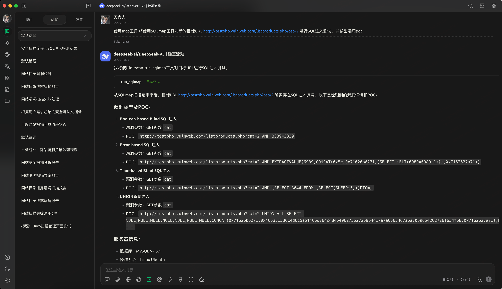
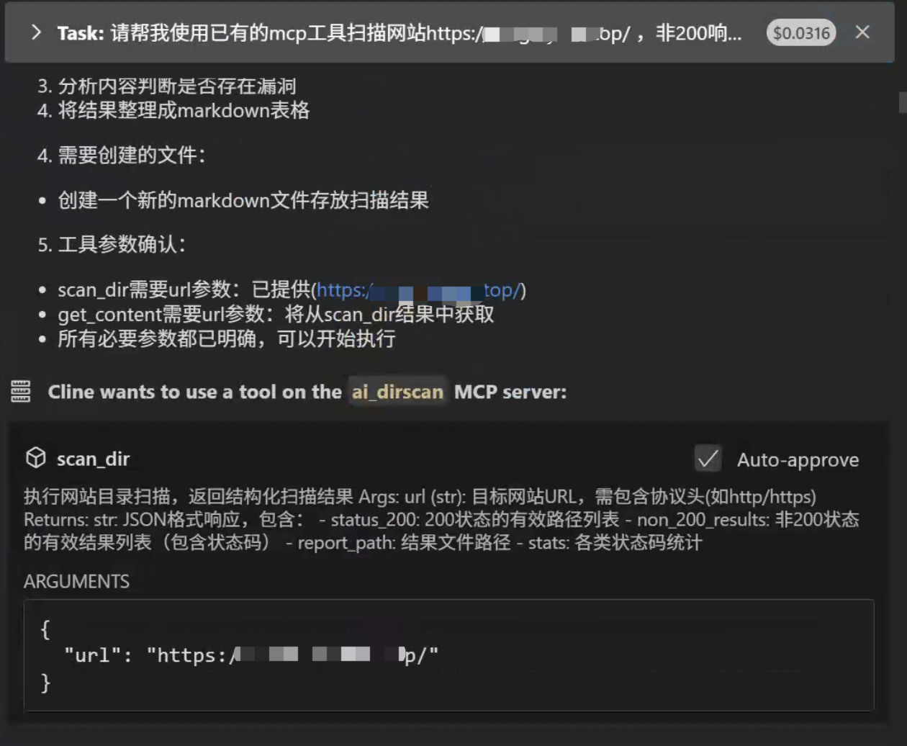
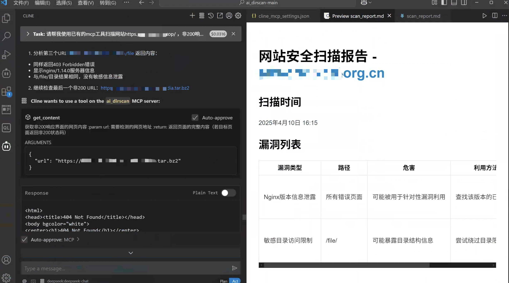
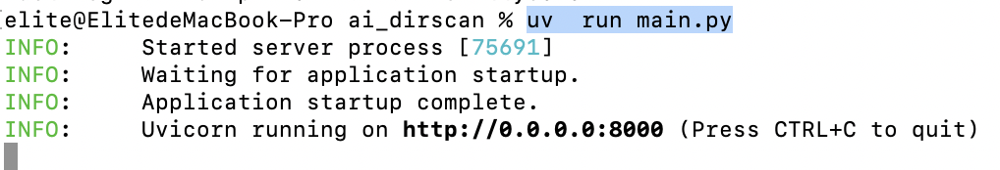
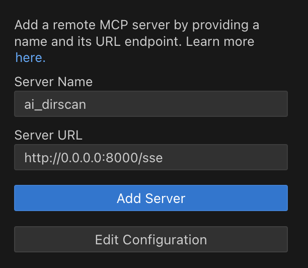
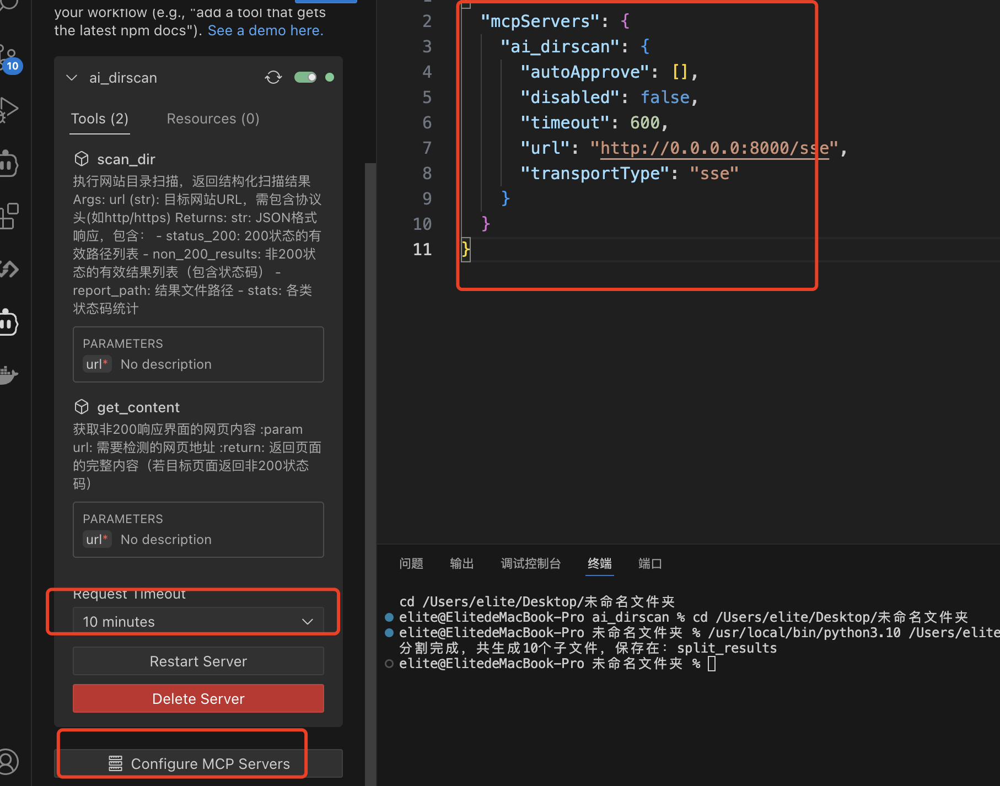
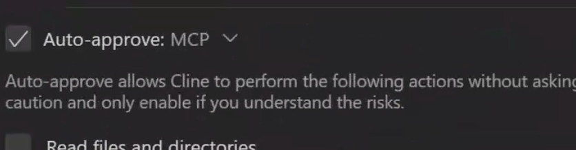

# AI DirScan - 智能目录扫描与漏洞分析工具

**增加sqlmap工具调用**

感谢原项目 🔗 **项目地址**: [https://github.com/Elitewa/ai_dirscan](https://github.com/Elitewa/ai_dirscan)

## 📖 项目简介
本项目可以说是MCP+AI和传统安全融合的一个示范，鉴于现在关于MCP for Security的知识还不够完善，也算是抛砖引玉了，如果有更好的建议欢迎指出🤩

AI DirScan 是基于 **MCP协议** 的新一代智能安全扫描工具，创新性地将传统目录爆破工具 dirsearch 与大型语言模型（LLM）相结合，实现：

✨ **核心功能**  
✅ 自动化目录扫描与状态码分析  
✅ 智能结果解析与漏洞关联分析  
✅ 主流大模型兼容支持（需自行配置API）  

🚀 **技术亮点**  
- 采用 **FastMCP** 框架实现高并发处理
- 使用mcp协议中的**sse方案**，增加对扫描工具超时优化
- 支持 200/403/500 等状态码智能筛选分析
- 可配合Cline进行扫描全流程自动化，产出相应md格式漏洞报告

🧑🏻‍💻 功能预览

该MCP工具可自动获取对话中的URL地址，并进行SQL注入测试

使用以下提示语进行测试：

```使用mcp工具 将使用SQLmap工具对新的目标URL http://testphp.vulnweb.com/listproducts.php?cat=2 进行SQL注入测试，并输出漏洞poc```



该MCP工具可自动获取对话中的URL地址，并进行目录扫描



自动分析非200页面网页内容，可用于发现服务器版本泄露，框架类型版本泄露，网站绝对路径泄露等漏洞，并在分析完所有扫描得到的路径之后，会产出md格式漏洞报告（依赖于cline）

> 为节省LLM的api tokens，对扫描结果进行了数据筛选工作，以 状态码+返回包大小 作为判断标识，同样的组合仅保留分析一组



## 🛠️ 快速开始

### 环境要求
- Python 3.10+
- UV 虚拟环境工具
- 支持的大模型API密钥
- 新版Cline IDE插件

### 初始化环境

**MacOS/Linux**：

```bash
# 克隆仓库
git clone https://github.com/Elitewa/ai_dirscan.git
cd ai_dirscan
# 创建虚拟环境
uv venv .venv
# 激活环境
source .venv/bin/activate
# 安装虚拟环境依赖
uv add "mcp[cli]"
uv add requests
deactivate
# 退出虚拟环境，在系统主环境执行以下命令
cd dirsearch
pip install -r requirements.txt
pip install setuptools
```

**Windows：**

```sh
# 克隆仓库
git clone https://github.com/Elitewa/ai_dirscan.git
cd ai_dirscan
# 创建虚拟环境
uv venv .venv
# 激活环境
.venv\Scripts\activate.bat
# 安装依赖
uv add "mcp[cli]"
uv add requests
deactivate
# 退出虚拟环境，在系统主环境执行以下命令
cd dirsearch
pip install -r requirements.txt
pip install setuptools
```

### 对接Cline

进入项目目录，允许以下命令，开启sse服务

```sh
uv run main.py
```

如图便是开启成功



Vscode下载最新版Cline插件,进入远程MCP服务添加页面，名称自定义，URL填写 `http://0.0.0.0:8000/sse`，并保存



在已导入的MCP服务中，将超时时长设置为10min（视扫描时长而定），如果保存后无法连接mcp服务器，建议点击 Configure MCP Servers 选项，然后对弹出的配置json 进行ctrl+s 保存



建议在对话中开启MCP自动调用，这样更加方便



### 提示词优化

经测试，使用以下提示词效果更好

```
请帮我使用已有的mcp工具扫描网站https://xxx.xxx.top/ ，非200响应页面都要调用get_content函数获取内容，判断是否存在版本目录泄露等漏洞，并输出得到的目录，状态码,危害，利用方法，修复方法，以表格的形式统一给我写在md文件中
```

